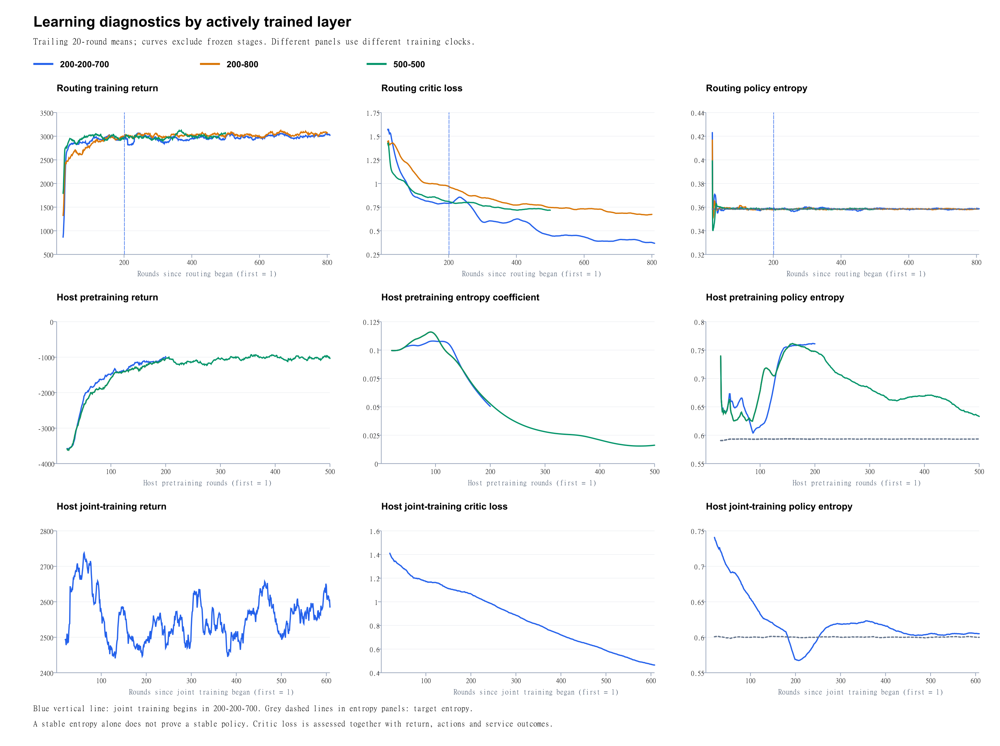

# Routing 与 Host 层的近收敛分析

## 判断口径

这里把“接近收敛的效果”理解为：回报、服务指标和动作统计已进入主要收益实现后的平台区间。用实际更新阶段的连续 50 轮均值判断趋势，并同时看 actor、critic、熵及熵系数。轮次是原始日志 episode，不是梯度更新步数。

这是对当前曲线的平台期估计，不是数学收敛判定或统一阈值检验。没有固定负载的独立评估曲线、参数变化量、梯度范数或多个训练随机种子的证据，因此不能给出精确的“第 N 轮已经收敛”。策略熵靠近目标熵只说明熵调节接近目标，不单独证明策略收敛。

## 判断结果

Routing 的策略与服务表现已经出现明显的近收敛特征。主要提升通常在前 100–200 轮实现，200-800 稍慢，约 150–250 轮接近后期效果。后续仍有小幅改善，critic loss 也继续下降。

Host 的收敛证据较弱。200 轮预训练结束时仍在明显变化；500 轮预训练日志显示约 200–300 轮后服务表现进入平台区间，但熵系数、actor 与 Q 值仍变化。只有 200-200-700 有联合阶段，Host 的动作行为约在联合训练 150–250 轮后接近后期状态，300–400 轮后更稳定；截至实际记录的 608 轮仍不能认定整个 Host 学习器完全收敛。

| 配置 | Routing 接近后期效果的估计 | 对应原始轮次 | Host 判断 |
|---|---|---|---|
| 200-200-700 | 单独训练约 100–150 轮；联合阶段开始后需重新观察，约联合 150–250 轮后动作行为接近后期状态 | Routing 约 300–350；联合约 550–650 | 200 轮预训练尚未充分稳定；联合后有行为平台，内部训练仍变化 |
| 200-800 | Routing 约 150–250 轮，200–300 轮后可视为主要收益已实现 | 约 350–450，保守观察到 400–500 | 仅训练前 200 轮，之后冻结，不能用后续平稳判断 Host 已收敛 |
| 500-500 | Routing 约 100–150 轮已接近后期服务效果，行为比例仍有缓慢调整 | 约 600–650 | 预训练效果约 200–300 轮进入平台，但截至 500 轮内部量仍漂移 |

范围是近似估计。“稳定”也不意味着达到最优表现。联合训练平台的 SLA／时延表现并未优于冻结 Host 的 200-800。

## Routing 的证据

| 配置 | Routing 窗口 | 回报 | 完成率（%） | SLA（%） | 策略熵 | Critic loss |
|---|---|---:|---:|---:|---:|---:|
| 200-200-700 | 1-50 | 2036.57 | 91.22 | 86.85 | 0.3844 | 1.3875 |
| 200-200-700 | 51-100 | 2874.59 | 97.00 | 92.32 | 0.3590 | 0.9479 |
| 200-200-700 | 101-150 | 2965.10 | 97.24 | 92.49 | 0.3582 | 0.8173 |
| 200-200-700 | 151-200 | 2957.36 | 97.18 | 92.32 | 0.3587 | 0.7895 |
| 200-200-700 | 751-800 | 3026.97 | 97.89 | 92.32 | 0.3585 | 0.3798 |
| 200-800 | 1-50 | 2085.93 | 92.13 | 88.17 | 0.3821 | 1.4027 |
| 200-800 | 101-150 | 2930.69 | 96.90 | 92.91 | 0.3584 | 1.0096 |
| 200-800 | 151-200 | 2973.52 | 97.21 | 93.12 | 0.3580 | 0.9792 |
| 200-800 | 201-250 | 3010.55 | 97.46 | 93.44 | 0.3582 | 0.9162 |
| 200-800 | 751-800 | 3053.59 | 97.76 | 94.05 | 0.3581 | 0.6715 |
| 500-500 | 1-50 | 2450.60 | 93.51 | 90.09 | 0.3754 | 1.2130 |
| 500-500 | 51-100 | 2974.10 | 97.20 | 92.97 | 0.3588 | 0.9579 |
| 500-500 | 101-150 | 2982.11 | 97.21 | 92.60 | 0.3587 | 0.8651 |
| 500-500 | 451-500 | 3024.86 | 97.58 | 93.15 | 0.3584 | 0.7241 |

Routing 的目标熵为约 0.35835。三组在约 50–100 轮后，平均策略熵已靠近此值；actor loss 和 Q 值主要在 100–250 轮稳定下来。回报达到约 2950–3050 后，进一步训练的收益相对初期跃升明显减小。

但是 entropy 的稳定比任务表现稳定更早，不能把第 50 轮就称为完整收敛。200-200-700 的 critic loss 从 routing 第 151–200 轮的约 0.7895 继续降至第 751–800 轮的约 0.3798；200-800 从约 0.9792 降至 0.6715。因此“回报与服务效果接近稳定”比“所有网络量停止变化”更符合数据。

## Host 预训练的证据

200-800 与 500-500 的前 200 轮 Host 预训练在所核对的指标上相同，可用同一条预训练轨迹观察继续训练到 500 轮的变化。

| 配置 | Host 预训练窗口 | Host 回报 | 完成率（%） | SLA（%） | Host 熵系数 α | 策略熵 | 目标熵 |
|---|---|---:|---:|---:|---:|---:|---:|
| 200-200-700 | 101-150 | -1264.54 | 55.10 | 49.08 | 0.0950 | 0.7155 | 0.5934 |
| 200-200-700 | 151-200 | -1071.80 | 56.71 | 50.45 | 0.0586 | 0.7601 | 0.5933 |
| 200-800 | 101-150 | -1367.82 | 54.29 | 48.32 | 0.0907 | 0.7316 | 0.5934 |
| 200-800 | 151-200 | -1116.67 | 56.34 | 50.23 | 0.0603 | 0.7533 | 0.5933 |
| 500-500 | 151-200 | -1116.67 | 56.34 | 50.23 | 0.0603 | 0.7533 | 0.5933 |
| 500-500 | 201-250 | -1149.90 | 56.15 | 49.70 | 0.0402 | 0.7166 | 0.5933 |
| 500-500 | 251-300 | -1125.96 | 56.34 | 49.97 | 0.0299 | 0.6881 | 0.5933 |
| 500-500 | 351-400 | -983.82 | 57.51 | 50.90 | 0.0225 | 0.6682 | 0.5934 |
| 500-500 | 451-500 | -1037.04 | 57.12 | 50.28 | 0.0158 | 0.6383 | 0.5932 |

两份 200 轮预训练的日志，最后两个 50 轮窗口仍存在明显提升：完成率提升约 1.6–2.1 个百分点，Host 回报提升约 193–251。Host α 从约 0.09–0.095 降至约 0.059–0.060，策略熵约 0.75–0.76，明显高于目标约 0.593。因此 200 轮更适合作为获得可用初始化的预算，不能称为充分收敛。

从 200-800 的第 151–200 轮到 500-500 的第 451–500 轮，完成率仅增加 0.78 个百分点，SLA 增加 0.05 个百分点。额外 300 轮预训练的服务收益较小，约 200–300 轮后的曲线已经表现出平台特征。

但 Host 内部量还未完全稳定：第 251–300 轮到 451–500 轮的 α 从约 0.0299 降至 0.0158，策略熵从约 0.688 降至 0.638，仍高于目标熵约 0.593；actor loss 和 Q 值也继续漂移。预训练达到效果平台与网络充分收敛应分别报告。

## Host 联合训练的证据

只有 200-200-700 实际进入此阶段。Host 冻结期间的回报和服务变化，主要体现输入任务／routing 策略变化，不能说明 Host 网络在继续学习。

| 联合训练窗口 | 原始轮次 | Host 立即启动（%） | Host 回报 | Host critic loss | 策略熵 | 目标熵 |
|---|---|---:|---:|---:|---:|---:|
| 1-50 | 401–450 | 54.85 | 2599.38 | 1.3445 | 0.7191 | 0.6001 |
| 51-100 | 451–500 | 50.14 | 2630.85 | 1.1932 | 0.6701 | 0.6001 |
| 101-150 | 501–550 | 45.71 | 2514.73 | 1.1394 | 0.6264 | 0.6005 |
| 151-200 | 551–600 | 46.38 | 2486.78 | 1.0802 | 0.5923 | 0.6005 |
| 251-300 | 651–700 | 44.63 | 2530.44 | 0.9102 | 0.6168 | 0.6004 |
| 351-400 | 751–800 | 44.23 | 2496.18 | 0.7442 | 0.6188 | 0.6001 |
| 451-500 | 851–900 | 44.47 | 2566.46 | 0.6105 | 0.6037 | 0.5997 |
| 551-600 | 951–1000 | 45.15 | 2598.76 | 0.4856 | 0.6051 | 0.6005 |

Host 立即启动率从联合前 50 轮的约 54.85% 降到第 101–150 轮的约 45.71%，之后主要在约 44%–46% 间波动，说明策略经过约 100–200 轮重新适应。熵在后期靠近约 0.600 的目标，而 critic loss 和 Q 值仍持续变化。最近两个完整 50 轮窗口，critic loss 约从 0.543 降至 0.486，Q 均值约从 1.739 增至 1.822，所以还没有所有内部训练量均已稳定的证据。

联合阶段约 150–250 轮可作为接近后期行为的估计，300–400 轮观察更稳妥。这里的平台是当前联合策略的行为平台，并非相比冻结 Host 的性能提升。

## 实验预算上的含义

若目标是接近目前日志的服务效果，可先以 Host 预训练 200–300 轮、Routing 单独训练 200–300 轮作为新的预算参照。Host 若要考察内部学习器是否继续接近收敛，可保留 400–500 轮预训练观察；当前 500 轮日志也仍有漂移，无法确定它之后的完整收敛轮次。

如需要联合训练，可在开始后约 200–300 轮进行固定负载的评估，300–400 轮观察稳定性，而不是因为训练更久就认定更好。上述轮数是基于当前日志的预算估计，改变阶段长度也会改变现有 λ 调度，不能保证截短后复现原曲线。

严谨验证需要在固定评估 seed 上测试保存的策略，冻结评估时的 λ 并报告多训练种子。按指标选择 checkpoint，比只看单轮训练回报或只看 critic loss 更可靠。只有这三份聚合日志，不能证明每个 DC 的 Host 都已稳定，聚合均值可能遮盖个体差异。

数据来源：用户指定的 200-200-700、200-800、500-500 三份 episode 日志。原始数据未修改，50 轮统计保存在 `phase_50_round_statistics.csv`。
