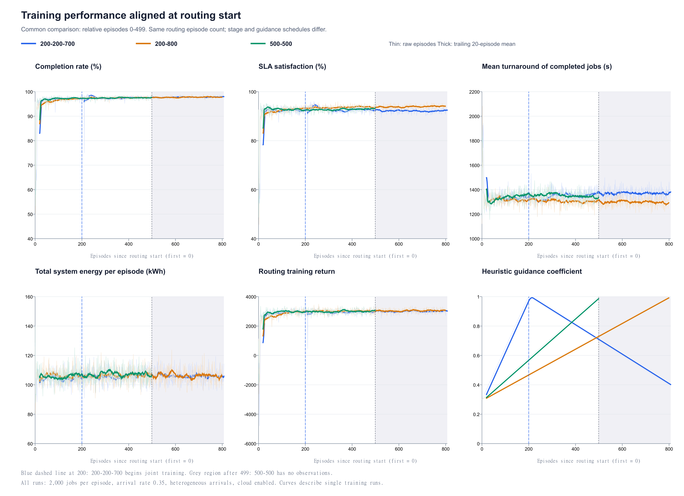
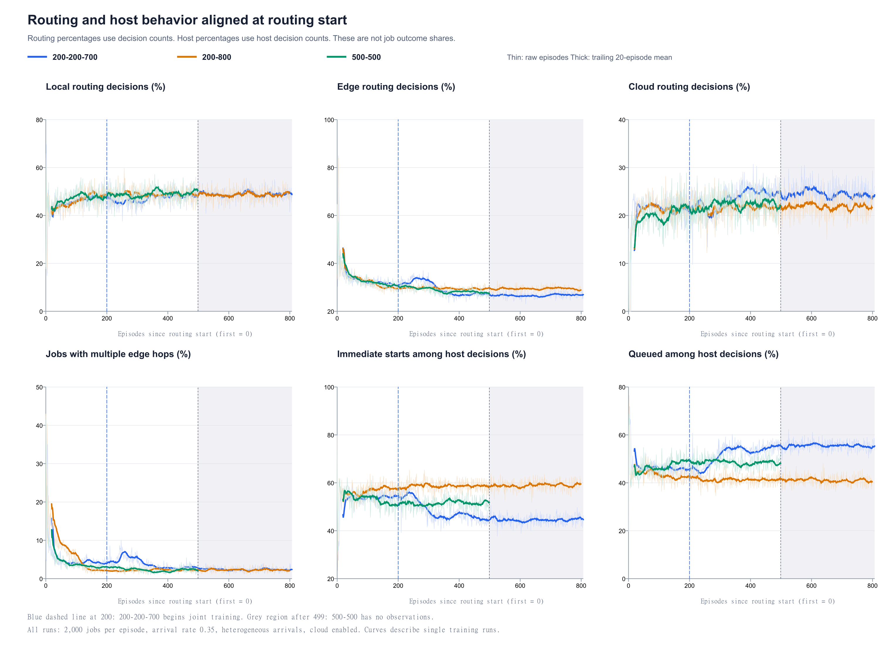

# Routing 开始轮次对齐分析

## 结论

在相同的 routing 训练进度下，三组完成率接近。以共同区间最后 100 轮（相对轮次 400–499，routing 第 401–500 轮）衡量，200-800 的 SLA 满足率最高、平均完成时间最短；200-200-700 的系统总能耗略低于 200-800，差距约 0.1%。500-500 初期学习更快，延长 Host 预训练的优势没有持续到后期。200-200-700 的联合训练没有在已记录区间表现出持续的 SLA／时延优势。

这只描述当前三次训练日志。阶段长度、Host 是否继续更新及启发式引导进度同时变化，不能把结果解释为某一个因素的独立因果效果。

## 对齐定义与实际阶段

以日志中第一个 `routing_train` episode 为零点，定义 `routing_relative_episode = episode − routing_start_episode`，`routing_training_round = routing_relative_episode + 1`。三份日志的第一轮 routing 更新也发生在该轮。200-200-700、200-800 的起点是 201，500-500 的起点是 501。

| 配置 | Host 预训练 | Routing 单独训练 | 联合训练 | routing 总轮数 |
|---|---|---|---|---:|
| 200-200-700 | 1–200（200 轮） | 201–400（200 轮） | 401–1008（608 轮） | 808 |
| 200-800 | 1–200（200 轮） | 201–1000（800 轮） | 未记录 | 800 |
| 500-500 | 1–500（500 轮） | 501–1000（500 轮） | 未记录 | 500 |

200-200-700 的文件名是实验配置标签；实际只记录了 608 轮联合训练，不能视为已经完成 700 轮。另两份日志尚无联合训练记录。200-200-700 的联合阶段在相对轮次 200 开始。共同有效 routing 区间为 0–499，共 500 轮。对应前两组原始轮次 201–700，以及 500-500 的原始轮次 501–1000。

图中细线为每轮原始值，粗线为向后 20 轮移动平均，移动平均在 routing 开始后重新计算，不混入预训练。蓝色虚线表示 200-200-700 进入联合训练，灰色区间表示 500-500 已无观测。图中不插值、不延长短日志。

## 相同 routing 预算下的结果

共同区间最后 100 轮，相对轮次 400–499。表中的 ± 是这 100 轮的样本标准差，反映轮间波动，不是独立重复实验的置信区间。

| 配置 | 完成率（%） | SLA 满足率（%） | 平均完成时间（秒） | 系统能耗（kWh/轮） | Routing 回报 |
|---|---:|---:|---:|---:|---:|
| 200-200-700 | 97.66 ± 0.47 | 92.68 ± 0.95 | 1357.3 ± 45.7 | 106.66 ± 5.26 | 2968.1 ± 151.1 |
| 200-800 | 97.57 ± 0.46 | 93.77 ± 0.78 | 1302.5 ± 36.6 | 106.77 ± 5.13 | 3027.8 ± 152.6 |
| 500-500 | 97.53 ± 0.54 | 93.02 ± 0.84 | 1341.3 ± 40.5 | 107.40 ± 4.76 | 3006.6 ± 150.2 |

- 200-800 对比 200-200-700：SLA 高 1.09 个百分点，平均完成时间少 54.8 秒（4.04%），系统能耗多 0.11 kWh/轮。完成率差 -0.09 个百分点。
- 200-800 对比 500-500：SLA 高 0.75 个百分点，平均完成时间少 38.9 秒（2.90%），系统能耗少 0.63 kWh/轮。完成率差 +0.04 个百分点。
- 因此，按这一共同训练预算，200-800 的优势主要在 SLA 和时延，不能称为完成率全面领先。能耗上的小差异不足以据单次运行确立稳健排名。

前 500 轮整体均值用于观察整段学习过程，包括初期探索损失：

| 配置 | 完成率（%） | SLA 满足率（%） | 平均完成时间（秒） | 系统能耗（kWh/轮） | Routing 回报 |
|---|---:|---:|---:|---:|---:|
| 200-200-700 | 96.76 | 92.04 | 1347.8 | 105.28 | 2853.3 |
| 200-800 | 96.75 | 92.77 | 1314.6 | 106.12 | 2882.3 |
| 500-500 | 97.01 | 92.51 | 1348.2 | 106.62 | 2934.7 |

## 初期学习速度

Routing 前 50 轮，相对轮次 0–49：

| 配置 | 完成率（%） | SLA 满足率（%） | 平均完成时间（秒） | 系统能耗（kWh/轮） | Routing 回报 |
|---|---:|---:|---:|---:|---:|
| 200-200-700 | 91.22 | 86.85 | 1387.1 | 103.56 | 2036.6 |
| 200-800 | 92.13 | 88.17 | 1350.2 | 105.07 | 2085.9 |
| 500-500 | 93.51 | 90.09 | 1340.4 | 105.73 | 2450.6 |

Routing 第 51–100 轮，相对轮次 50–99：

| 配置 | 完成率（%） | SLA 满足率（%） | 平均完成时间（秒） | 系统能耗（kWh/轮） | Routing 回报 |
|---|---:|---:|---:|---:|---:|
| 200-200-700 | 97.00 | 92.32 | 1331.7 | 105.22 | 2874.6 |
| 200-800 | 96.21 | 92.08 | 1322.4 | 106.68 | 2714.7 |
| 500-500 | 97.20 | 92.97 | 1329.3 | 104.72 | 2974.1 |

500-500 在这两个初期窗口的完成率、SLA 和 routing 回报都最高，说明当前日志中 500 轮 Host 预训练对应更快的初期 routing 学习。起点前 50 轮 Host 预训练的完成率仍约 56%–57%，延长预训练没有在仅本地执行的阶段带来类似 routing 开始后的跃升。这里的初期优势也可能包含随机初始化、到达负载和引导进度的影响。

## 联合训练后的变化

200-200-700 在相对轮次 200 进入联合训练。为观察过渡，比较它在切换前 50 轮、切换后首 50 轮，以及接下来的 50 轮：

| 区间 | 完成率（%） | SLA（%） | 平均完成时间（秒） | Host 立即启动（%） | Host 排队（%） |
|---|---:|---:|---:|---:|---:|
| 150–199 | 97.18 | 92.32 | 1339.59 | 54.24 | 45.73 |
| 200–249 | 97.61 | 93.43 | 1320.05 | 54.85 | 45.12 |
| 250–299 | 97.28 | 93.11 | 1336.66 | 50.14 | 49.85 |
| 300–399 | 97.36 | 92.28 | 1356.99 | 46.04 | 53.94 |
| 400–499 | 97.66 | 92.68 | 1357.25 | 45.55 | 54.44 |
| 700–799 | 97.82 | 92.12 | 1369.69 | 44.70 | 55.29 |

联合训练切换后没有出现完成率崩溃。随后 Host 立即启动比例下降、排队比例上升，云端 routing 决策比例增加，同时 SLA 和时延没有持续改善。这些走势与联合更新带来的策略变化相伴出现，但引导系数也在同期下降，无法仅凭日志把变化归因于 Host 更新。

共同区间最后 100 轮的行为比较：

| 配置 | 本地决策（%） | 边缘决策（%） | 云端决策（%） | 多跳任务（%） | Host 立即启动（%） | Host 排队（%） |
|---|---:|---:|---:|---:|---:|---:|
| 200-200-700 | 48.19 | 27.13 | 24.66 | 2.77 | 45.55 | 54.44 |
| 200-800 | 48.86 | 29.39 | 21.74 | 2.21 | 58.64 | 41.34 |
| 500-500 | 49.44 | 27.97 | 22.58 | 2.27 | 51.46 | 48.53 |

## 后续走势与各自最后 100 轮

200-200-700 与 200-800 可继续比较到相对轮次 799，且每个相对轮次对应相同的 workload seed。相对轮次 700–799，200-200-700 的完成率约 97.82%，200-800 为 97.83%；SLA 分别为 92.12% 和 94.07%；平均完成时间分别为 1369.7 秒和 1294.7 秒。前者总能耗稍低，但 SLA／时延差距仍存在。末尾额外 8 轮只保留在曲线和逐轮数据，不作为完整 100 轮窗口。

各自最后 100 轮如下。其 routing 预算不同，仅用于描述日志结尾，不能替代同进度比较：

| 配置 | 完成率（%） | SLA 满足率（%） | 平均完成时间（秒） | 系统能耗（kWh/轮） | Routing 回报 |
|---|---:|---:|---:|---:|---:|
| 200-200-700 | 97.82 | 92.15 | 1370.0 | 105.70 | 3006.4 |
| 200-800 | 97.83 | 94.07 | 1294.7 | 106.25 | 3059.9 |
| 500-500 | 97.53 | 93.02 | 1341.3 | 107.40 | 3006.6 |

对应相对区间：200-200-700 为 708–807，200-800 为 700–799，500-500 为 400–499。

## 指标口径与可比性

1. SLA 满足率为 SLA 满足任务数／全部任务数，丢弃任务不会被排除。平均完成时间只统计已完成任务的 turnaround time，包含其等待等时间。完成率与 SLA 一起看，避免仅比较成功任务的耗时。
2. `training_episode_reward` 在三份文件中逐轮等于 `routing_layer_reward_sum`。它是 routing 训练回报。Host 预训练阶段该字段为零，不能解释为系统没有收益；也不把 routing 和 host 的回报相加构造新的系统回报。
3. Routing 的本地／边缘／云端比例分母是 routing 决策次数。任务可被重复路由，所以这些比例不是最终任务去向或云端完成任务占比。Host 立即启动／排队比例的分母是 host 决策次数，排队并不等同于最终失败。
4. 共同最后 100 轮的平均引导系数分别为 0.7501、0.6938、0.9306。200-200-700 的 λ 在相对轮次 199 升至 1，再随联合阶段下降；200-800 在相对轮次 799 才升至 1；500-500 在 499 升至 1。因此对齐轮次后，引导强度仍然不同。
5. 三份日志在相同原始 episode 的 workload seed 和所有数值型 `workload_*` 字段一致。对齐后前两组仍是相同 workload；500-500 的 workload seed 相比前两组偏移 300，不能按对齐后的每一轮进行同负载配对差值检验。
6. 每轮均为 2000 个任务，总到达率 0.35，异构到达，cloud 启用，能耗权重 0.3，能耗归一化常数 170000 J。没有重复或缺失 episode，未决任务、pending trace、causal terminal gap、未知／缺失来源均为零。学习损失／熵的 NaN 主要出现在该学习器未更新的阶段，保留为缺失，不填零。
7. 对齐的是训练轮次，而非真实时间或梯度更新次数。相对 0–499 累积 routing 更新分别为 732,406、731,736、721,266 次。每轮 routing 决策数不同，所以更新预算也有小幅差异。CSV 没有训练开始时间戳；这里的“开始时间对齐”使用 routing 首轮作为横轴零点。
8. 当前只有每个配置的一次训练运行。轮间标准差包含负载与训练过程波动，不能代表跨随机种子的实验稳定性，也不据此宣称统计显著或测试集性能。

## 后续实验建议

如果要选当前已观察到的训练安排，200-800 是 SLA／时延表现较好的参照方案。下一步可固定共同的 workload seed 序列、相同 routing 更新预算及独立于阶段的 λ 变化曲线，再比较 200 与 500 轮 Host 预训练、以及 Host 冻结与联合更新。用多个独立训练随机种子，并对保存的策略进行同负载的确定性评估，才能判断阶段轮数的稳健影响。

## 输出说明

- `routing_aligned_metrics.csv`：保留原始轮次、seed、阶段，以及相对轮次、routing 轮号和分析所需指标。
- `window_summary.csv`：所有完整窗口的均值和样本标准差，及各自最后 100 轮。
- `stage_boundaries.csv`：由实际日志提取的阶段边界。
- 两组 SVG／PNG 图：性能曲线与策略行为曲线。
- `verification.json`：数据口径核对和原始文件 SHA-256，用于复现溯源。

数据来源：200-200-700.csv、200-800.csv、500-500.csv，均位于用户提供的“不同的三阶段”目录。原始日志未修改。
